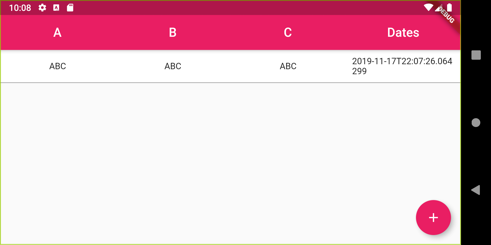

# ABC (Activating Event, Beliefs, Consequences)
> App for CBT (Cognitive Behavioral Therapy)

Cognitive behavioral therapy (CBT) is a type of psychotherapeutic treatment that helps patients understand the thoughts and feelings that influence behaviors. CBT is commonly used to treat a wide range of disorders, including phobias, addictions, depression, and anxiety

> Uses of Cognitive Behavior Therapy
Cognitive behavior therapy has been used to treat people suffering from a wide range of disorders, including:

- Anxiety
- Phobias
- Depression
- Addictions
- Eating disorders
- Panic attacks
- Anger

> CBT is one of the most researched types of therapy, in part because treatment is focused on highly specific goals and results can be measured relatively easily.

> The ABC Model

**A - Activating Event or objective situation.** The first column records the objective situation, that is, an event that ultimately leads to some type of high emotional response or negative dysfunctional thinking.

**B - Beliefs.** In the second column, the client writes down the negative thoughts that occurred to them.

**C - Consequence.** The third column is for the negative feelings and dysfunctional behaviors that ensued. The negative thoughts of the second column are seen as a connecting bridge between the situation and the distressing feelings. The third column C is next explained by describing emotions or negative thoughts that the client thinks are caused by A. This could be anger, sorrow, anxiety, etc.

Ellis believes that it is not the activating event (A) that causes negative emotional and behavioral consequences (C), but rather that a person interpret these events unrealistically and therefore has a irrational belief system (B) that helps cause the consequences (C).

